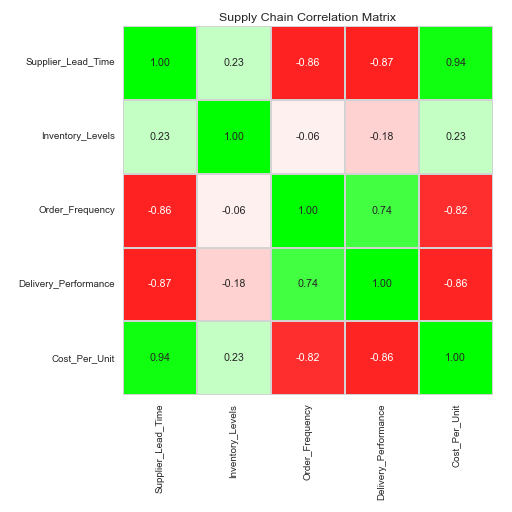

# Supply Chain Analytics: Correlation Matrix

This repository contains a correlation analysis of key supply chain metrics to identify relationships and optimize performance.

## Author
Email: 24f1002750@ds.study.iitm.ac.in

## Files
-   `correlation.csv`: The correlation matrix values.
-   `heatmap.png`: A visualization of the correlation matrix using Excel-style conditional formatting (Red-White-Green).

## Analysis
The analysis explores the relationships between:
-   Supplier Lead Time
-   Inventory Levels
-   Order Frequency
-   Delivery Performance
-   Cost Per Unit

## Visualization

